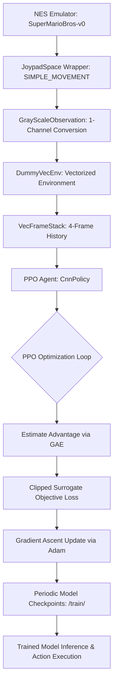

# Mario Reinforcement Learning Model Using Proximal Policy Optimization (PPO)

An end-to-end Reinforcement Learning (RL) framework developed to train an autonomous agent to play and navigate the complex, dynamic environment of **Super Mario Bros (World 1-1)** using the **Proximal Policy Optimization (PPO)** algorithm. The model balances exploration and exploitation while maintaining policy stability to avoid obstacles, eliminate enemies, and maximize cumulative game rewards.

---

## 📌 Problem Definition & Pipeline Architecture

Training an agent to play Super Mario Bros involves sequential decision-making in a high-dimensional visual state space with delayed rewards. The training workflow processes visual inputs from the NES emulator and optimizes the control policy across four core stages:

* **Step 1 (Environment Setup & Control Simplification):** The base game emulator (`SuperMarioBros-v0`) is initialized using `gym-super-mario-bros` and `nes-py`. To make action selection efficient, the action space is restricted using the `JoypadSpace` wrapper with `SIMPLE_MOVEMENT` (discrete actions for moving right, jumping, etc.).
* **Step 2 (Observation Preprocessing):** Raw RGB frames are converted to grayscale using `GrayScaleObservation(keep_dim=True)` to reduce visual dimensionality while preserving key spatial features. The environment is wrapped in `DummyVecEnv` for vectorization and `VecFrameStack` (stacking 4 consecutive frames) to provide the agent with temporal motion and velocity context.
* **Step 3 (PPO Model Training with CNN Policy):** A Deep Reinforcement Learning agent is constructed using `stable_baselines3.PPO` equipped with a `CnnPolicy` (Convolutional Neural Network) to extract spatial-temporal features directly from stacked frames. Training proceeds iteratively across 1,000,000 timesteps using a custom callback that monitors steps and checkpoints model weights every 10,000 calls.
* **Step 4 (Evaluation & Gameplay Inference):** The best-performing saved checkpoint is loaded into the vectorized inference pipeline. The agent takes actions by predicting the policy output $\pi(a|s)$ in real time, successfully navigating obstacles, timing jumps over pipes, and evading Goombas.

## 📐 Mathematical Formulation

### 1. Reinforcement Learning Objective
The agent interacts with the environment to discover an optimal policy $\pi^*(a|s)$ that maximizes the expected discounted cumulative reward:

$$\pi^*(a|s) = \arg\max_{\pi} \mathbb{E}_{\tau \sim \pi} \left[ \sum_{t=0}^{\infty} \gamma^t r_t \,\Big|\, s_0 = s, a_t = a, \pi \right]$$

* **$s_t$**: Visual state (stacked grayscale frames) at time step $t$.
* **$a_t$**: Action executed from the `SIMPLE_MOVEMENT` discrete action set.
* **$r_t$**: Immediate game reward earned at time step $t$.
* **$\gamma$**: Discount factor balancing immediate vs. future returns.

---

### 2. PPO Clipped Surrogate Objective
To prevent destructive policy updates during gradient ascent, PPO optimizes a clipped surrogate objective function:

$$L(s, a, \theta) = \min \left( r_t(\theta) A(s, a),\, \text{clip}(r_t(\theta), 1 - \epsilon, 1 + \epsilon) A(s, a) \right)$$

* **Probability Ratio $r_t(\theta)$**: Measures the divergence between the current and old policies:

$$r_t(\theta) = \frac{\pi_\theta(a|s)}{\pi_{\theta_{\text{old}}}(a|s)}$$

* **Advantage Function $A(s, a)$**: Quantifies whether taking action $a$ in state $s$ yields a better return than the expected average, estimated using Generalized Advantage Estimation (GAE):

$$A(s, a) = \sum_{t=0}^{T-1} \delta_t, \quad \text{where } \delta_t = r_t + \gamma V(s_{t+1}) - V(s_t)$$

* **Clipping Hyperparameter $\epsilon$**: Constrains $r_t(\theta)$ within the interval $[1 - \epsilon, 1 + \epsilon]$, ensuring stable and sample-efficient policy updates.

---

## 📊 Evaluation & Training Metrics

* **Action Space Reduction**: Mapping complex controller inputs to `SIMPLE_MOVEMENT` eliminates non-viable button combinations and accelerates convergence.
* **Temporal Frame Stacking**: Stacking 4 consecutive grayscale frames allows the CNN policy to infer Mario's running momentum and the trajectories of approaching enemies.
* **Checkpoint Callbacks**: Periodically evaluates training checkpoints (e.g., at 500,000 and 1,000,000 timesteps) to isolate the policy that achieves optimal obstacle traversal and level completion rates.

---

## 🛠️ Tech Stack & Libraries

* **Gym & NES-Py (`gym-super-mario-bros`, `nes-py`)**: NES emulator interface, memory integration, and environment wrappers.
* **Stable-Baselines3 (`stable_baselines3`)**: Production-grade implementation of Proximal Policy Optimization (PPO) and callback hooks.
* **Gym Wrappers (`gym.wrappers`)**: Observation preprocessing including `GrayScaleObservation`.
* **PyTorch (`torch`)**: Underlying deep learning computation engine powering the CNN actor-critic networks.
* **Matplotlib (`matplotlib.pyplot`)**: Visualizing input observations and stacked frame channels.
* **TensorBoard**: Monitoring loss curves, entropy, value function loss, and episode reward statistics.
